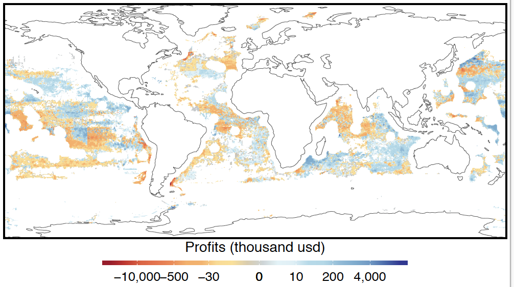
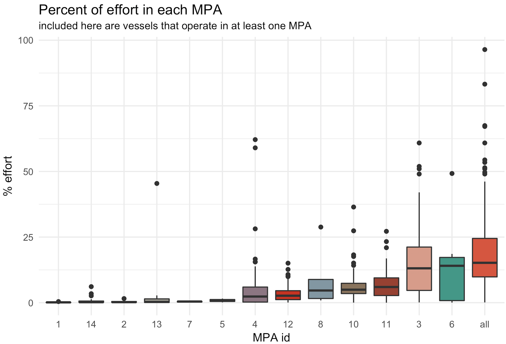

```{r setup, include=FALSE}
options(htmltools.dir.version = FALSE)
```

# Global Fishing Watch in Action

- What are economic costs and benefits of fishing the high seas and what is the role of government subsidies ?

<br>

--

- How well do we currently know the spatial provenance of marine fish harvest?

<br>

--

- How has transparent and open data helped protect close to 1 million square kilometers of the ocean in 4 different countries in 2017?

<br>

---

# The economics of fishing the high seas

--

 
--

 
--

 
--
 

---
class: center
# The economics of fishing the high seas

 

---
# Validating current spatial catch datasets

 

---
class: middle, center

# Validating current spatial catch datasets

 

---
class: middle, center

# Validating current spatial catch datasets

 

---
# Advancing marine conservation

 

---
# Advancing marine conservation
<br>
<br>
<br>
<br>
 
 


